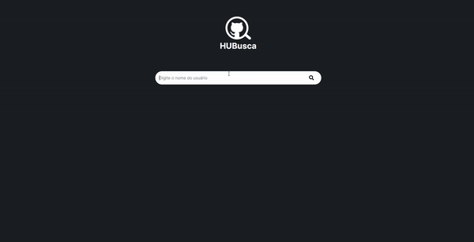

<a name="readme-top"></a>

<br />
<div align="center">
  <a href="https://github.com/GabryelBoer/hubusca">
    
  </a>
  <h2 align="center">HUBusca</h2>

  
    <br />
    <a href="https://hubusca-mauve.vercel.app/">Deploy do Projeto</a>
    <br />
    <br />
</div>

<details>
  <summary>Índice</summary>
  <ol>
    <li><a href="#about-the-project">Sobre o Projeto</a></li>
    <li><a href="#requests">Requisitos</a></li>
    <li><a href="#tech">Tecnologias Utilizadas</a></li>
    <li><a href="#func">Funcionalidades</a></li>
    <li><a href="#req">Requisitos e Instalação</a></li>
    <li><a href="#autor">Autor</a></li>
  </ol>
</details>

<br />
<a name="about-the-project"></a>

## Sobre o Projeto

Desenvolvido como parte do desafio na Clicksoft para a vaga de estágio em Desenvolvimento Front End Web, este projeto foi criado para facilitar a pesquisa de perfis de desenvolvedores por meio da API do GitHub.

<br />
<a name="requests"></a>

## Requisitos do Desafio

1. Permita que na tela principal busquemos os dados de uma pessoa do GitHub através do nome de usuário. E que no resultado apareça a foto, o nome, o login e a localização.

2. Permita que ao clicar na foto, abra um perfil com os dados que a API do GitHub fornece: Foto, nome, login, localização, o ID, quantidade de seguidores, quantidade de repositórios públicos, e uma lista com todos os repositórios da pessoa (nome do repositório, linguagem utilizada, descrição, data de criação, data do último push).

3. Ao clicar em um repositório, seremos redirecionados para este repositório no site do GitHub.

4. Crie um menu contendo todos os usuários pesquisados recentemente, que também siga o padrão com os dados iguais ao da tarefa 1, e com perfil igual ao da tarefa 2.

<br />
<a name="tech"></a>

## Tecnologias Utilizadas

- [![React][React.js]][React-url]
- [![Vite][Vite]][Vite-url]
- [![Styled-Components][Styled-Components]][Styled-Components-url]
- [![React-Router][React-Router]][React-Router-url]
- [![Axios][Axios]][Axios-url]

<br />
<a name="func"></a>

## Funcionalidades

### Busca de Perfis no GitHub:

Explore uma vasta gama de perfis de desenvolvedores apenas digitando o nome de usuário do GitHub. Permitindo que você encontre facilmente os perfis que procura.

### Perfil Detalhado do Desenvolvedor:

Após localizar um perfil, obtenha o perfil completo do desenvolvedor. Visualize seus repositórios públicos, seguidores, e informações de perfil.

### Acesso aos Repositórios do Desenvolvedor:

Explore os repositórios de um desenvolvedor em detalhes.

### Aba de Desenvolvedores Pesquisados Recentemente:

Histórico dos desenvolvedores que pesquisados recentemente, permitindo um acesso rápido e fácil para revisitar os perfis visitados.

<br />
<a name="req"></a>

## Requisitos e Instalação

- Node.js instalado em sua máquina.

1. Clone o repositório:
   ```sh
   git clone https://github.com/seu-usuario/nome-do-repositorio.git
   ```
2. Acesse o diretório do projeto:
   ```sh
   cd nome-do-repositorio
   ```
3. Instale as dependências:
   ```sh
   npm install
   ```
4. Inicie o servidor de desenvolvimento:
   ```sh
   npm run dev
   ```

<br />
<a name="autor"></a>

## Autor

Gabryel Boer - [Linkedin](https://www.linkedin.com/in/gabryelboer/) - gabryel.boer@gmail.com

Meu GitHub: [Github](https://github.com/GabryelBoer)

Link do Projeto: [https://github.com/GabryelBoer/hubusca](https://github.com/GabryelBoer/hubusca)

<p align="right">(<a href="#readme-top">Voltar para o topo</a>)</p>

[React.js]: https://img.shields.io/badge/React-20232A?style=for-the-badge&logo=react&logoColor=61DAFB
[React-url]: https://reactjs.org/
[Styled-Components]: https://img.shields.io/badge/styled--components-DB7093?style=for-the-badge&logo=styled-components&logoColor=white
[Styled-Components-url]: https://styled-components.com
[Vite]: https://img.shields.io/badge/vite-%23646CFF.svg?style=for-the-badge&logo=vite&logoColor=white
[Vite-url]: https://vitejs.dev
[React-Router]: https://img.shields.io/badge/React_Router-CA4245?style=for-the-badge&logo=react-router&logoColor=white
[React-Router-url]: https://reactrouter.com/en/main
[Axios]: https://img.shields.io/badge/axios-671ddf?&style=for-the-badge&logo=axios&logoColor=white
[Axios-url]: https://axios-http.com/ptbr/docs/intro
